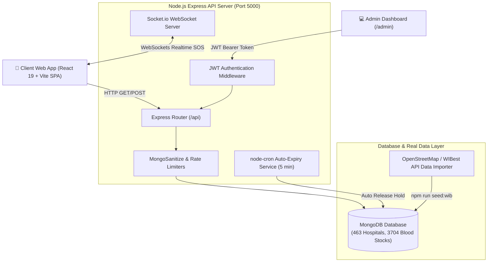
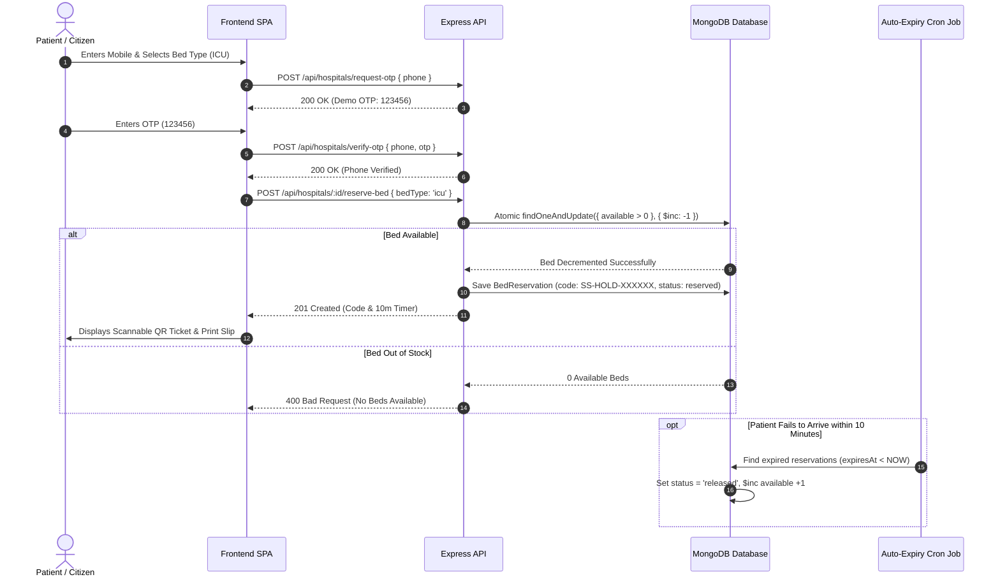
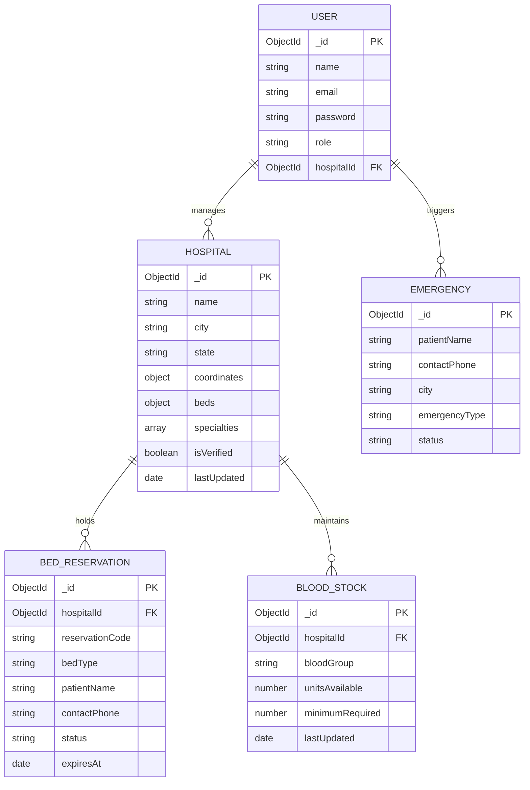

# 🏥 SwasthyaSetu (स्वास्थ्य सेतु) — MERN Stack Emergency Healthcare Platform

[](https://nodejs.org/)
[](https://expressjs.com/)
[](https://react.dev/)
[](https://vitejs.dev/)
[](https://www.mongodb.com/)
[](https://socket.io/)
[](https://tailwindcss.com/)
[](LICENSE)

> **Real-Time Emergency Bed Availability, Scannable QR Bed Hold Tickets & Blood Bank Coordination Network for India.**
> Connecting patients, emergency responders, hospitals, and blood banks when every second counts.

---

## 🌟 Key Features & Architectural Highlights

### 1. 🛏️ Real-Time Hospital Bed Tracker & Freshness Badges
- **Live ICU, General & Ventilator Bed Counting**: Tracks available vs. total capacity across 463+ real Indian hospitals.
- **Data Freshness Engine**: Displays **🟢 Live (< 2h)**, **🟡 Stale (2-6h)**, and **🩶 Outdated (> 6h)** badges based on the `lastUpdated` timestamp.

### 2. 🎟️ Atomic Concurrency Lock & Printable QR Code Tickets
- **Concurrency-Safe Reservation**: Prevents double-booking via MongoDB `findOneAndUpdate` atomic operators (`$inc: { 'beds.<type>.available': -1 }`).
- **10-Minute Auto-Expiry Cron**: `node-cron` running every 5 minutes releases abandoned holds and increments bed counts back.
- **Phone OTP Guard**: Validates 10-digit Indian mobile numbers (`/^[6-9]\d{9}$/`) with demo OTP verification (`123456`).
- **Scannable QR Ticket**: Custom SVG QR Code generator encoding confirmation code `SS-HOLD-XXXXXX`. Includes a 1-click **Print / Save PDF Ticket** formatted with `@media print` CSS.

### 3. 🗺️ High-Precision Geocoding Map & Dynamic Filters
- **Pan-India Map View**: Integrated Leaflet.js interactive map displaying hospital pins across 35+ Indian cities.
- **200m Precision Geocoding**: Loaded exact real-world Google Maps GPS coordinates for famous hospitals (AIIMS Delhi, Safdarjung, Medanta, KEM Mumbai, Tata Memorial, Apollo Chennai, CMC Vellore, SSKM Kolkata, SGPGI Lucknow, etc.).
- **Dynamic City Dropdown & Full-Text Search**: Filters hospitals by city, bed type, and specialty keyword matching.

### 4. 🚨 Real-Time Emergency SOS Broadcast
- **Socket.io WebSockets**: Broadcasts instant room-scoped SOS alerts (`city-${cityName}`) to online emergency responders and hospital dashboards.
- **Location Finder**: Automatically detects patient GPS coordinates or allows manual city fallback.

### 5. 🩸 Blood Bank Inventory & Donor Network
- **3,704 Blood Stock Items**: Live search for blood groups (`A+`, `O-`, etc.) across registered hospitals.
- **Voluntary Donor Registration**: Connects patients with verified blood donors.

### 6. 🌐 Multilingual & Transparent Degraded Mode
- **English & Hindi Support**: 1-Click language toggle (`en` / `hi`).
- **Transparent Degraded Demo Mode**: In-memory store fallback when local MongoDB is offline.

---

## 📐 System Architecture

### 1. High-Level Architecture Diagram



---

### 2. Atomic Bed Reservation & Concurrency Lock Flow



---

### 3. Entity Relationship (ER) Diagram



---

## ⚡ Quick Start Guide

### 1. Installation

Clone the repository and install all dependencies:

```bash
git clone https://github.com/Shubham-k-yadav/SwasthyaSetu.git
cd SwasthyaSetu
npm run setup
```

---

### 2. Database Seeding Commands

Populate MongoDB with real Indian hospitals, coordinates, and blood stocks:

| Command | Description |
| :--- | :--- |
| **`npm run seed:wib`** | **(Recommended)** Imports **463 Real Indian Hospitals** across 35+ cities with 3,704 blood stock entries. |
| **`npm run seed:real`** | Seeds 23 top metropolitan hospital centers (AIIMS, Safdarjung, Medanta, KEM, etc.). |
| **`npm run seed`** | Base seed script with initial mock data & admin accounts. |

```bash
cd backend
npm run seed:wib
```

---

### 3. Running the Server

Start both Backend API (Port 5000) and Frontend SPA (Port 3000):

```bash
# Run from root directory
npm run dev
```

- **Client Web App**: [http://localhost:3000](http://localhost:3000)
- **Backend API Server**: [http://localhost:5000](http://localhost:5000)
- **API Health Check**: [http://localhost:5000/health](http://localhost:5000/health)

---

## 🔑 Demo Credentials

| Role | Email | Password | Access Level |
| :--- | :--- | :--- | :--- |
| **Super Admin** | `superadmin@swasthyasetu.in` | `SwasthyaSetu@2026` | Full Network & Verification Queue Control |
| **AIIMS Admin** | `admin@aiims.edu` | `AIIMS@2024` | AIIMS Hospital Bed & Blood Management |

---

## 📡 API Reference Overview

| Endpoint | Method | Description | Auth Required |
| :--- | :--- | :--- | :--- |
| `GET /health` | GET | Server health & DB connection status | ❌ No |
| `GET /api/hospitals` | GET | List hospitals (with pagination `limit=500` & city filtering) | ❌ No |
| `POST /api/hospitals/request-otp` | POST | Request 10-digit mobile verification OTP | ❌ No |
| `POST /api/hospitals/verify-otp` | POST | Verify mobile OTP | ❌ No |
| `POST /api/hospitals/:id/reserve-bed` | POST | Atomic concurrency bed hold (10-min lock) | ❌ No |
| `POST /api/hospitals/reservations/:code/release` | POST | Cancel active hold & restore bed count | ❌ No |
| `GET /api/blood` | GET | Search blood availability across blood banks | ❌ No |
| `POST /api/emergency/request` | POST | Submit emergency SOS alert & broadcast via Sockets | ❌ No |
| `POST /api/auth/login` | POST | Hospital Admin / Superadmin JWT login | ❌ No |
| `POST /api/auth/refresh` | POST | Silent JWT token renewal | 🔑 Bearer Token |
| `GET /api/hospitals/pending/queue` | GET | View pending hospital approval queue | 🔑 Superadmin |

---

## 📜 License
MIT License. Developed for SwasthyaSetu Healthcare Network India.
